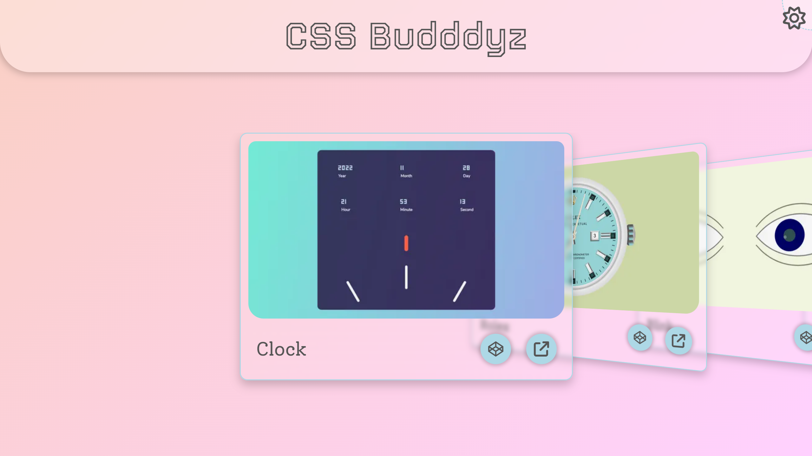
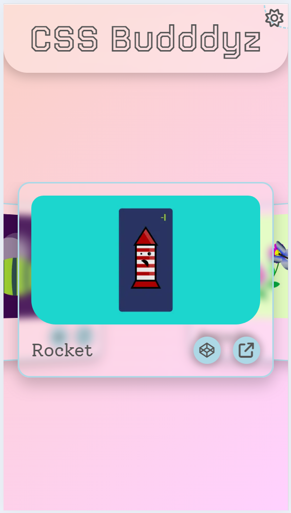
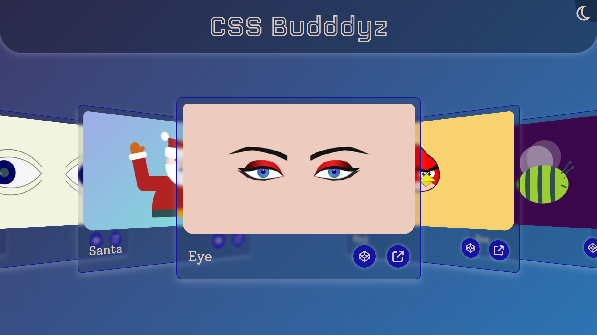
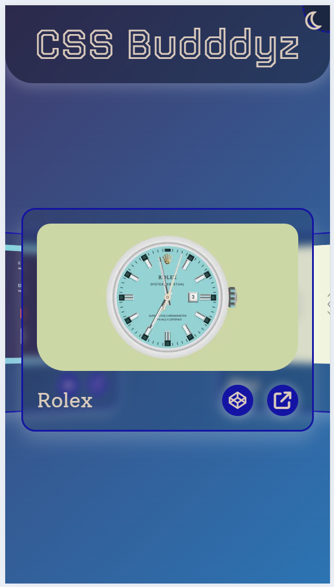
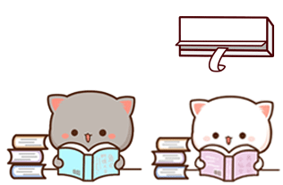

<h1><u>ℂ𝕊𝕊 𝔹𝕦𝕕𝕕𝕕𝕪𝕫</u></h1>

A showcase website made with the collaboration between me and my girlfriend [Shuktika](https://github.com/Shuktika15) to represent our **CSS** skills.

## Technology

The website is made with [SolidJS](https://www.solidjs.com/). And the projects are build with mostly `HTML`
and `CSS/SCSS`.
Sometime for animation `JavaScript/Typescript` is used.

The projects are also deployed in my *CodePen* profile. Please
visit [CodePen@RitamChakraborty](https://codepen.io/RitamChakraborty/).

## Features

- Fun animations to scroll between projects
- Glassmorphism effect
- Fully responsive
- Adaptive theme
- Keyboard input

## Demo

> #### Light Theme

    
    

> #### Dark Theme

    
    

## Deployment

Check out the deployed website [here](https://ritamchakraborty.github.io/cssbudddyz/).

<blockquote align="center">
    <h1>𝔊𝔦𝔳𝔢 𝔦𝔱 𝔞 𝔰𝔱𝔞𝔯 𝔦𝔣 𝔶𝔬𝔲 𝔩𝔦𝔨𝔢𝔡 𝔦𝔱</h1>
     
    
</blockquote>
